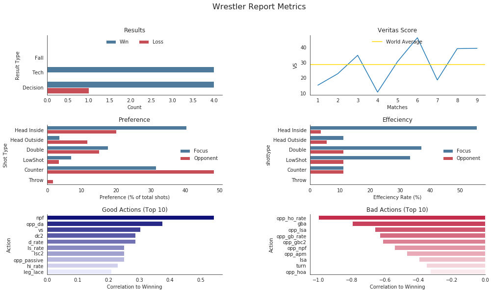

```python
import pandas as pd
import numpy as np
import matplotlib.pyplot as plt
import seaborn as sns

pwd = !pwd
```


```python
matches = pd.read_csv(pwd[0][:-8]+'/stats/matchdata.csv')
events = pd.read_csv(pwd[0][:-8]+'/stats/events.csv')
ts = pd.read_csv(pwd[0][:-8]+'/stats/timeseries.csv')
wrestlers = pd.read_csv(pwd[0][:-8]+'/stats/wrestlers.csv')
wrestlers.head()
```


<div>
<style scoped>
    .dataframe tbody tr th:only-of-type {
        vertical-align: middle;
    }

    .dataframe tbody tr th {
        vertical-align: top;
    }

    .dataframe thead th {
        text-align: right;
    }
</style>
<table border="1" class="dataframe">
  <thead>
    <tr style="text-align: right;">
      <th></th>
      <th>name</th>
      <th>rating</th>
      <th>team_id</th>
      <th>ew</th>
    </tr>
  </thead>
  <tbody>
    <tr>
      <th>0</th>
      <td>Robert Rehm</td>
      <td>968</td>
      <td>USA</td>
      <td>0.90</td>
    </tr>
    <tr>
      <th>1</th>
      <td>Paul Glynn</td>
      <td>984</td>
      <td>USA</td>
      <td>2.60</td>
    </tr>
    <tr>
      <th>2</th>
      <td>Blaize Cabell</td>
      <td>959</td>
      <td>USA</td>
      <td>1.75</td>
    </tr>
    <tr>
      <th>3</th>
      <td>Ben Whitford</td>
      <td>1038</td>
      <td>USA</td>
      <td>6.30</td>
    </tr>
    <tr>
      <th>4</th>
      <td>Johnni DiJulius</td>
      <td>993</td>
      <td>USA</td>
      <td>5.25</td>
    </tr>
  </tbody>
</table>
</div>


```python
# calculates effective wins and assigns row-wise
for person in matches.focus_id.unique():
    group = matches[matches['focus_id']==person]
    ew = group.num_result.mean() * len(group.index)
    for i, row in wrestlers.iterrows():
        if row['name'] == person:
            wrestlers.at[i, 'ew'] = round(ew, 2)
```


```python
wrestlers.sort_values('ew', ascending=False).head()
```


<div>
<style scoped>
    .dataframe tbody tr th:only-of-type {
        vertical-align: middle;
    }

    .dataframe tbody tr th {
        vertical-align: top;
    }

    .dataframe thead th {
        text-align: right;
    }
</style>
<table border="1" class="dataframe">
  <thead>
    <tr style="text-align: right;">
      <th></th>
      <th>name</th>
      <th>rating</th>
      <th>team_id</th>
      <th>ew</th>
    </tr>
  </thead>
  <tbody>
    <tr>
      <th>332</th>
      <td>Jason Nolf</td>
      <td>1130</td>
      <td>USA</td>
      <td>15.45</td>
    </tr>
    <tr>
      <th>312</th>
      <td>Nathan Jackson</td>
      <td>1108</td>
      <td>USA</td>
      <td>14.75</td>
    </tr>
    <tr>
      <th>109</th>
      <td>Tyler Graff</td>
      <td>1160</td>
      <td>USA</td>
      <td>14.65</td>
    </tr>
    <tr>
      <th>98</th>
      <td>Garrett Ryan</td>
      <td>1105</td>
      <td>USA</td>
      <td>14.50</td>
    </tr>
    <tr>
      <th>213</th>
      <td>Jaydin Eierman</td>
      <td>1105</td>
      <td>USA</td>
      <td>14.05</td>
    </tr>
  </tbody>
</table>
</div>


# Start here


```python
# sample for a singluar athlete report page
print('Be sure to follow spelling as seen on the official site.')
athlete = input('Enter wrestler: ')
fm = matches[matches.focus_id==athlete]
```

    Be sure to follow spelling as seen on the official site.
    Enter wrestler: Zain Retherford
    


```python
def find_result_types(row):
    if row == 'WinF':
        return 'Fall'
    elif row == 'WinTF':
        return 'Tech'
    elif row == 'WinD':
        return 'Decision'
    elif row == 'LossD':
        return 'Decision'
    elif row == 'LossTF':
        return 'Tech'
    elif row == 'LossF':
        return 'Fall'


fm.loc[:,['binary_result']] = [1 if row > 1 else 0 for row in fm.num_result.values]
fm.loc[:,['binary_result_text']] = ['Win' if row > 1 else 'Loss' for row in fm.num_result.values]
fm.loc[:,['result_type']] = [find_result_types(row) for row in fm.result.values]
fm = fm[fm.duration != 0]

```

    /home/nanthony007/VeritasAnalytics-Website/venv/lib/python3.5/site-packages/pandas/core/indexing.py:543: SettingWithCopyWarning: 
    A value is trying to be set on a copy of a slice from a DataFrame.
    Try using .loc[row_indexer,col_indexer] = value instead
    
    See the caveats in the documentation: http://pandas.pydata.org/pandas-docs/stable/indexing.html#indexing-view-versus-copy
      self.obj[item] = s
    


```python
HIC = fm.hia.sum()
HOC = fm.hoa.sum()
DC = fm.da.sum()
LSC = fm.lsa.sum()
GBC = fm.gba.sum()
TC = fm.ta.sum()
totalTDA = fm.hia.sum() + fm.hoa.sum() + fm.da.sum() + fm.lsa.sum() + fm.gba.sum() + fm.ta.sum() 

oHIC = fm.opp_hia.sum()
oHOC = fm.opp_hoa.sum()
oDC = fm.opp_da.sum()
oLSC = fm.opp_lsa.sum()
oGBC = fm.opp_gba.sum()
oTC = fm.opp_ta.sum()
ototalTDA = fm.opp_hia.sum() + fm.opp_hoa.sum() + fm.opp_da.sum() + fm.opp_lsa.sum() + fm.opp_gba.sum() + fm.opp_ta.sum() 

```


```python
shot_labels = ['Head Inside', 'Head Outside', 'Double', 'LowShot', 'Counter', 'Throw', 
               'Head Inside', 'Head Outside', 'Double', 'LowShot', 'Counter', 'Throw']
athlete = ['Focus', 'Focus', 'Focus', 'Focus', 'Focus', 'Focus',
          'Opponent', 'Opponent', 'Opponent', 'Opponent', 'Opponent', 'Opponent']

rates = [fm.hi_rate.mean(), fm.ho_rate.mean(), fm.d_rate.mean(), fm.ls_rate.mean(), fm.gb_rate.mean(), fm.t_rate.mean(),
         fm.opp_hi_rate.mean(), fm.opp_ho_rate.mean(), fm.opp_d_rate.mean(), fm.opp_ls_rate.mean(), fm.gb_rate.mean(), fm.opp_t_rate.mean()]

prefs = [(HIC/totalTDA) * 100, (HOC/totalTDA) * 100, (DC/totalTDA) * 100, (LSC/totalTDA) * 100, (GBC/totalTDA) * 100, (TC/totalTDA) * 100,
        (oHIC/ototalTDA) * 100, (oHOC/ototalTDA) * 100, (oDC/ototalTDA) * 100, (oLSC/ototalTDA) * 100, (oGBC/ototalTDA) * 100, (oTC/ototalTDA) * 100]

rate_df = pd.DataFrame()
rate_df['wrestler'] = athlete
rate_df['shottype'] = shot_labels
rate_df['rate'] = rates
rate_df['pref'] = prefs
fm2 = pd.melt(fm, id_vars=['binary_result'], value_vars=['npf'])
```


```python
fm_inter = fm.select_dtypes(exclude=['object'])
fm_inter = fm_inter.drop(columns=['mov', 'focus_score', 'opp_score', 'num_result'])

corrs = fm_inter.corr()['binary_result'][:-1].dropna()
corrs = corrs[corrs > -1]
corrs = corrs[corrs < 1]
bad = corrs.sort_values(ascending=True)[:10]
good = corrs.sort_values(ascending=False)[:10]
```


```python
sns.set_style('white', {'axes.spines.right':False, 'axes.spines.top':False})

fig, ((ax1, ax2), (ax3, ax4), (ax5, ax6)) = plt.subplots(3,2, figsize=(16,9))
plt.subplots_adjust(wspace = 0.50, hspace = 0.50)

g1 = sns.countplot(y='result_type', hue='binary_result_text', data=fm, order=['', 'Fall', 'Tech', 'Decision'],
            palette=sns.diverging_palette(240, 10, n=2), ax=ax1)
ax1.set_title('Results')
ax1.set_xlabel("Count")
ax1.set_ylabel("Result Type")
ax1.legend(loc='upper center', ncol=2, frameon=False)

g2 = sns.lineplot(data=fm, x=range(1, len(fm.index)+1), y='vs', ax=ax2)
ax2.axhline(fm.vs.mean(), label='World Average', color='gold')
ax2.set_title("Veritas Score")
ax2.set_xlabel("Matches")
ax2.set_ylabel("VS")
ax2.legend(loc='upper center', frameon=False)
ax2.legend_.set_title("")

g3 = sns.barplot(x='pref', y='shottype', hue='wrestler', data=rate_df,  
            palette=sns.diverging_palette(240, 10, n=2), ax=ax3)
ax3.set_title('Preference')
ax3.set_xlabel("Preference (% of total shots)")
ax3.set_ylabel("Shot Type")
ax3.legend(loc='center right', frameon=False)
ax3.legend_.set_title("")

g4 = sns.barplot(x='rate', y='shottype', hue='wrestler', data=rate_df,
            palette=sns.diverging_palette(240, 10, n=2), ax=ax4)
ax4.set_title('Effeciency')
ax4.set_xlabel("Effeciency Rate (%)")
ax4.legend(loc="center right", frameon=False)
ax4.legend_.set_title("")

g5 = sns.barplot(x=good.values, y=good.index, palette=sns.light_palette("darkblue", 10, reverse=True), ax=ax5)
ax5.set_title('Good Actions (Top 10)')
ax5.set_xlabel("Correlation to Winning")
ax5.set_ylabel("Action")

g6 = sns.barplot(x=bad.values, y=bad.index, palette=sns.light_palette("crimson", 10, reverse=True), ax=ax6)
ax6.set_title('Bad Actions (Top 10)')
ax6.set_xlabel("Correlation to Winning")
ax6.set_ylabel("Action")

plt.suptitle('Wrestler Report Metrics',size=16)
plt.savefig('reports.png', dpi=400)
plt.show()

```





```python
sns.palplot(sns.diverging_palette(240, 10, n=10, center='light'))
```


<script>
  $(document).ready(function(){
    $('div.prompt').hide();
    $('div.back-to-top').hide();
    $('nav#menubar').hide();
    $('.breadcrumb').hide();
    $('.hidden-print').hide();
  });
</script>

<footer id="attribution" style="float:right; color:#999; background:#fff;">
Created with Jupyter, delivered by Fastly, rendered by Rackspace.
</footer>

```python

```
